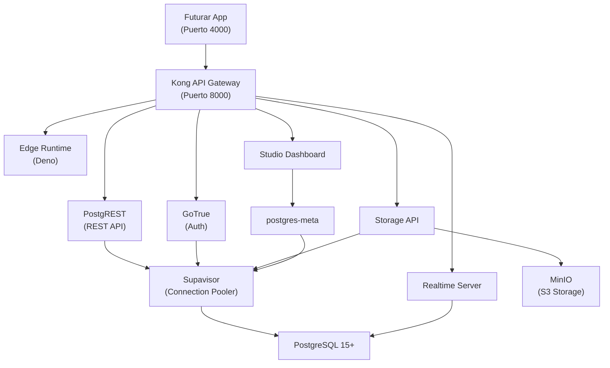

# Supabase Self-Hosted con Docker — Guía para Futurar

Guía paso a paso para levantar Supabase con Docker en tu servidor propio, adaptada al proyecto Futurar.

> [!IMPORTANT]
> Referencia oficial: [supabase.com/docs/guides/self-hosting/docker](https://supabase.com/docs/guides/self-hosting/docker)

---

## 1. Requisitos del Servidor

| Recurso | Mínimo | Recomendado |
|---------|--------|-------------|
| CPU | 2 cores | 4+ cores |
| RAM | 4 GB | 8 GB |
| Disco | 20 GB SSD | 50+ GB SSD |
| SO | Linux (Ubuntu 22.04+) | Ubuntu 24.04 LTS |

### Software necesario

```bash
# Docker Engine
curl -fsSL https://get.docker.com | sh
sudo usermod -aG docker $USER

# Docker Compose (viene incluido con Docker Engine moderno)
docker compose version  # Verificar instalación

# Git
sudo apt install -y git
```

---

## 2. Instalación

### Linux / macOS
```bash
# 1. Crear directorio y descargar SOLO la carpeta docker
mkdir supabase-futurar && cd supabase-futurar

git init
git remote add origin https://github.com/supabase/supabase.git
git sparse-checkout init --cone
git sparse-checkout set docker
git pull origin master --depth 1

# 2. Mover los archivos de docker a la raíz y limpiar
cp -rf docker/* .
cp docker/.env.example .env
rm -rf docker .git

# 3. Descargar las imágenes
docker compose pull
```

### Windows (PowerShell)
```powershell
# 1. Crear directorio y descargar SOLO la carpeta docker
mkdir supabase-futurar; cd supabase-futurar

git init
git remote add origin https://github.com/supabase/supabase.git
git sparse-checkout init --cone
git sparse-checkout set docker
git pull origin master --depth 1

# 2. Mover los archivos de docker a la raíz y limpiar
Copy-Item -Path "docker\*" -Destination "." -Recurse -Force
Copy-Item -Path "docker\.env.example" -Destination ".\.env"
Remove-Item -Path "docker" -Recurse -Force
Remove-Item -Path ".git" -Recurse -Force
Remove-Item CHANGELOG.md, CONTRIBUTING.md, DEVELOPERS.md, LICENSE, Makefile, package.json, pnpm-lock.yaml, pnpm-workspace.yaml, prettier.config.mjs, turbo.json, tsconfig.json, knip.jsonc, ".npmrc", ".nvmrc", "supa-mdx-lint.config.toml", README.md, SECURITY.md, versions.md, ".cursorignore", ".misspell-fixer.ignore", ".prettierignore" -Force

# 3. Descargar las imágenes
docker compose pull
```

> [!TIP]
> Esto descarga solo ~2 MB (la carpeta `docker/`) en vez de los ~500 MB+ del repositorio completo.

---

## 3. Configuración de Seguridad

> [!CAUTION]
> **NUNCA** uses los valores por defecto del `.env.example` en producción. Cada secreto debe ser único y generado de forma segura.

### 3.1 Contraseña de la Base de Datos

Editar `.env`:
```env
POSTGRES_PASSWORD=tu_contraseña_segura_aqui
```

> Solo usar letras y números para evitar problemas de encoding en connection strings.

### 3.2 Claves JWT y API Keys

Usar el script automático (experimental):
```bash
sh ./utils/generate-keys.sh
```

O generar manualmente. Editar `.env` con estos valores:

| Variable | Descripción | Cómo generar |
|----------|------------|--------------|
| `JWT_SECRET` | Firma de tokens JWT (PostgREST + Auth) | `openssl rand -base64 48` |
| `ANON_KEY` | Clave pública para el cliente (rol `anon`) | Generador JWT con el `JWT_SECRET` |
| `SERVICE_ROLE_KEY` | Clave privada del servidor (rol `service_role`) | Generador JWT con el `JWT_SECRET` |

Para generar `ANON_KEY` y `SERVICE_ROLE_KEY`, visitar [supabase.com/docs/guides/self-hosting/docker#generate-and-configure-api-keys](https://supabase.com/docs/guides/self-hosting/docker#generate-and-configure-api-keys) y usar el generador interactivo con tu `JWT_SECRET`.

### 3.3 Otros Secretos

Cada uno se genera con `openssl`:

```bash
# Ejecutar todos y anotar los resultados
echo "SECRET_KEY_BASE:       $(openssl rand -base64 48)"
echo "VAULT_ENC_KEY:         $(openssl rand -hex 16)"
echo "PG_META_CRYPTO_KEY:    $(openssl rand -base64 24)"
echo "LOGFLARE_PUBLIC_TOKEN: $(openssl rand -base64 24)"
echo "LOGFLARE_PRIVATE_TOKEN:$(openssl rand -base64 24)"
echo "S3_ACCESS_KEY_ID:      $(openssl rand -hex 16)"
echo "S3_ACCESS_KEY_SECRET:  $(openssl rand -hex 32)"
echo "MINIO_ROOT_PASSWORD:   $(openssl rand -hex 16)"
```

Copiar cada valor a su variable correspondiente en `.env`:

| Variable `.env` | Valor generado |
|---|---|
| `SECRET_KEY_BASE` | Resultado del primer comando |
| `VAULT_ENC_KEY` | (exactamente 32 caracteres) |
| `PG_META_CRYPTO_KEY` | (mínimo 32 caracteres) |
| `LOGFLARE_PUBLIC_ACCESS_TOKEN` | — |
| `LOGFLARE_PRIVATE_ACCESS_TOKEN` | — |
| `S3_PROTOCOL_ACCESS_KEY_ID` | — |
| `S3_PROTOCOL_ACCESS_KEY_SECRET` | — |
| `MINIO_ROOT_PASSWORD` | (mínimo 8 caracteres) |

### 3.4 URLs del Proyecto

Reemplazar `TU_DOMINIO_O_IP` con tu dominio o IP pública:

```env
SUPABASE_PUBLIC_URL=http://supabase.try-ema.com:8000
API_EXTERNAL_URL=http://supabase.try-ema.com:8000
SITE_URL=http://futurar.try-ema.com:4000
```

> `SITE_URL` es donde corre Futurar (tu app frontend, puerto 4000).

### 3.5 Autenticación del Dashboard (Studio)

```env
DASHBOARD_USERNAME=admin
DASHBOARD_PASSWORD=tu_password_segura
```

> La contraseña debe incluir al menos una letra. No usar solo números ni caracteres especiales.

---

## 4. Iniciar Supabase

```bash
# Levantar todos los servicios en segundo plano
docker compose up -d

# Verificar que todos estén healthy
docker compose ps

# Ver logs de un servicio específico si hay problemas
docker compose logs auth
docker compose logs rest
docker compose logs analytics
```

Esperar ~1 minuto. Todos los servicios deben mostrar `Up (healthy)`.

---

## 5. Acceso a los Servicios

Una vez levantado, todo se accede a través del **puerto 8000**:

| Servicio | URL |
|----------|-----|
| **Studio (Dashboard)** | `http://TU_IP:8000` |
| **REST API** | `http://TU_IP:8000/rest/v1/` |
| **Auth API** | `http://TU_IP:8000/auth/v1/` |
| **Storage API** | `http://TU_IP:8000/storage/v1/` |
| **Realtime** | `http://TU_IP:8000/realtime/v1/` |
| **Edge Functions** | `http://TU_IP:8000/functions/v1/` |

### Conectar a Postgres directamente

```bash
# Conexión por sesión (directo)
psql 'postgres://postgres.your-tenant-id:TU_PASSWORD@TU_IP:5432/postgres'

# Conexión pooled (transaccional)  
psql 'postgres://postgres.your-tenant-id:TU_PASSWORD@TU_IP:6543/postgres'
```

---

## 6. Conectar Futurar al Supabase Self-Hosted

Una vez que Supabase esté corriendo, actualizar el `.env` del proyecto Futurar:

```env
# Antes (Supabase Cloud - ya no disponible)
# VITE_SUPABASE_URL=https://twlnvsznmljezvzbpqrj.supabase.co
# VITE_SUPABASE_ANON_KEY=eyJhbGci...

# Después (Self-hosted)
VITE_SUPABASE_URL=http://TU_IP:8000
VITE_SUPABASE_ANON_KEY=tu_anon_key_generada
```

> [!WARNING]
> También necesitarás **recrear las tablas** de Futurar en tu nueva instancia. Consulta el archivo `types/database.ts` del proyecto para ver el esquema completo de tablas necesarias.

---

## 7. Detener y Actualizar

```bash
# Detener
docker compose down

# Actualizar a la última versión
cd ../supabase && git pull
cp -rf docker/* ../supabase-futurar/
cd ../supabase-futurar
docker compose pull
docker compose up -d
```

> [!CAUTION]
> Para eliminar completamente (incluidos datos):
> ```bash
> docker compose down -v
> rm -rf volumes/db/data
> rm -rf volumes/storage
> ```

---

## 8. Arquitectura de Servicios



---

## 9. Checklist de Despliegue

- [ ] Servidor con Docker y Docker Compose instalados
- [ ] Repositorio clonado y archivos copiados
- [ ] `POSTGRES_PASSWORD` cambiada
- [ ] `JWT_SECRET` generado
- [ ] `ANON_KEY` generada con el JWT_SECRET
- [ ] `SERVICE_ROLE_KEY` generada con el JWT_SECRET
- [ ] Todos los secretos adicionales generados (6 claves)
- [ ] URLs configuradas con IP/dominio real
- [ ] `DASHBOARD_PASSWORD` configurada
- [ ] `docker compose up -d` ejecutado
- [ ] Todos los servicios en estado `healthy`
- [ ] Studio accesible en `http://IP:8000`
- [ ] Tablas de Futurar creadas (migración del esquema)
- [ ] `.env` de Futurar actualizado con nueva URL y ANON_KEY
- [ ] Futurar conectando correctamente al Supabase local
